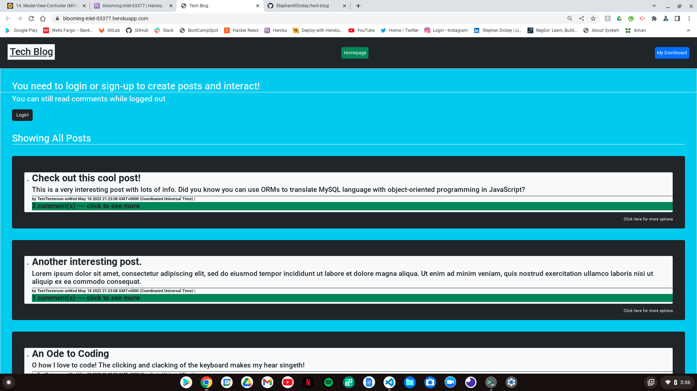
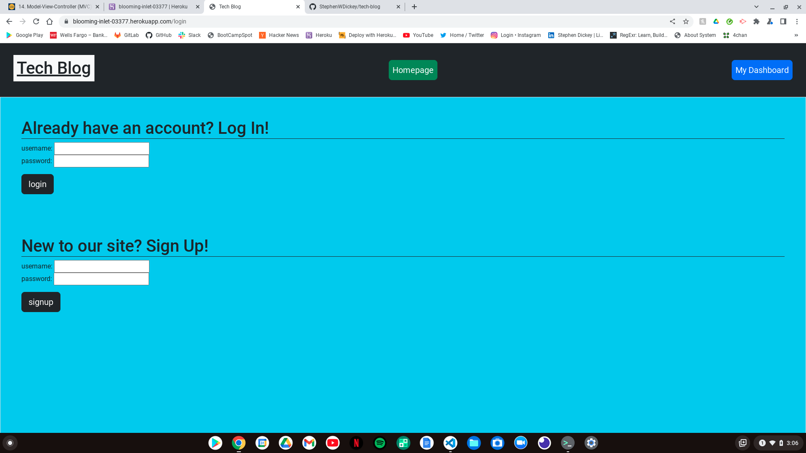
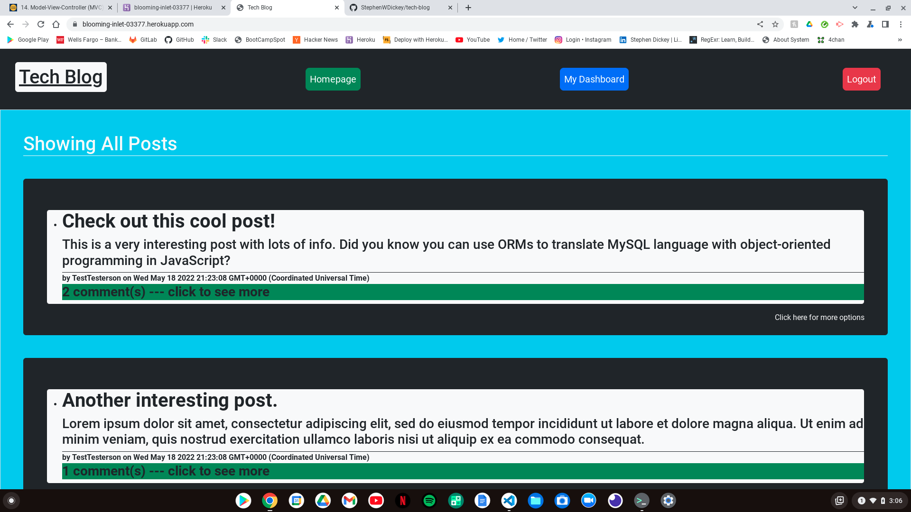
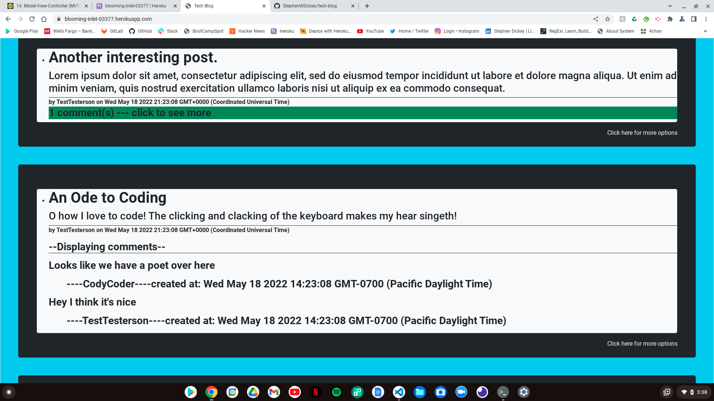
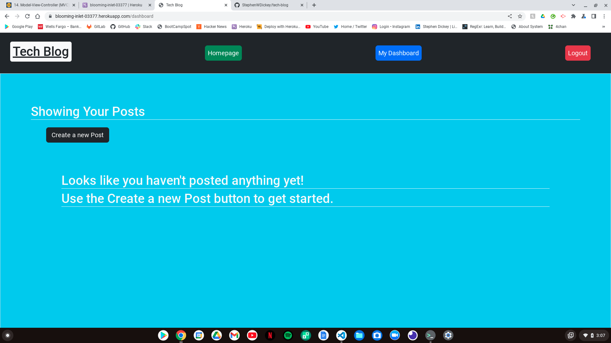
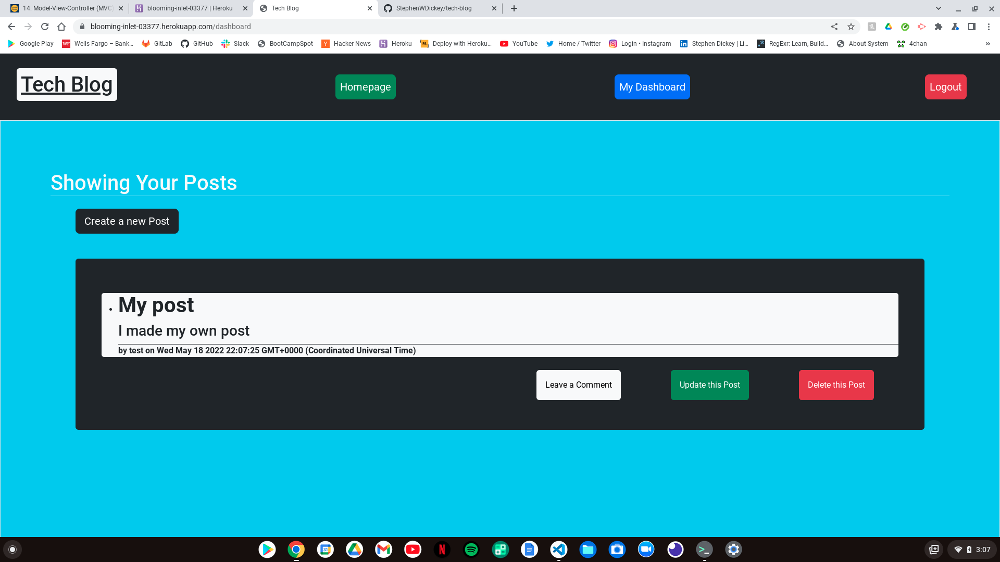

# tech-blog

;

;

## Description 

In this week's challenge we were tasked with building a CMS-style blog site. 

On this site, a user can view all posts and comments on the homepage without being logged in. Users will also see nav links to the homepage and dashboard.

Once the user logs in, they can comment on posts on the homepage. 

While logged in, the navigation bar at the top of the website features links to the homepage, the user dashboard, and for logging out.

While logged in, the user can create posts, edit posts, delete posts and comment on their own posts while on the dashboard page. 

Posts show the post title, post content, the name of the user that created the post, and when the post was created. 

Comments show the comment text, the name of the user that wrote the comment, and when the comment was created. 

If the user remains inactive for 30 seconds while logged in, their session will end and the user will have to log back in. If the user clicks anywhere within the site, then the timer will reset for another 30 seconds before logging them out.

I used a variety of packages in Node.js including: bcrypt, connect-session-sequelize, dotenv, express, express-handlebars, express-session, mysql2, and sequelize.

The project contains Models for Users, Posts, and Comments that are featured on the site, and each of these Models has routes to api endpoints for CRUD operations.

The database is created via the MySQL shell using the command 'SOURCE db/schema.sql'. The database is connected to our javascript files via a Sequelize connection, which uses environmental variables through the dotenv module to specify the database name, the database user, and the database password.

Initial data is seeded to the database using a variety of seed files, which can be run using the command 'npm run seed'.

The server connection is established using the command 'node server.js'.

This project will be deployed to Heroku.

## Credits

Stephen Dickey - the author of this project (me).
GitHub page: https://github.com/StephenWDickey
Heroku deployment: https://blooming-inlet-03377.herokuapp.com/

Marcelo Gachet - Coding Bootcamp Instructor

Joseph Jepson - Coding Bootcamp tutor